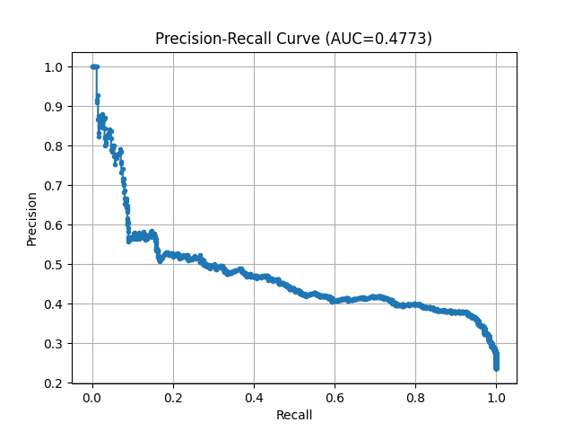

## CycloneNet – Test‑Set Validation Report

This document presents the final diagnostic performance of the CycloneNet framework on the **test set**, which comprises storms not seen during training or validation. The metrics below are computed with the threshold that maximises recall (≥90%) on the validation set and then applied unchanged to the test set (threshold = 0.1536). All results are derived from the same pipeline used during development, ensuring full reproducibility.

---

### 📊 Global Test‑Set Metrics

| Metric                     | Value       | Interpretation                                              |
| -------------------------- | ----------- | ----------------------------------------------------------- |
| **ROC‑AUC**                | 0.7760      | Good overall discriminative power                           |
| **PR‑AUC**                 | 0.4784      | Balanced precision‑recall on the minority class             |
| **Recall**                 | **0.902**   | **High sensitivity** – captures >90% of actual RI events    |
| **Precision**              | 0.380       | Acceptable given the recall target                          |
| **F1‑score**               | 0.535       | Harmonic mean of precision and recall                       |
| **Brier score**            | 0.153       | Well‑calibrated probabilistic outputs                       |
| **Spatial error (mean)**   | 53.5 km     | Influenced by a few large errors; median is more robust     |
| **Spatial error (median)** | **18.1 km** | **Sub‑grid accuracy**, well within ERA5 resolution (≈28 km) |

> **Note:** The mean spatial error is higher due to a small number of samples where the predicted hotspot deviated significantly. The median error of 18 km (less than one ERA5 grid cell) reflects the typical localisation capability.

---

### 🔍 Comparison with Validation Performance

During training, the best validation epoch achieved recall of 90.8% and PR‑AUC of 0.530. The test‑set results are very close, confirming that the model generalises well and does not suffer from severe overfitting. The optimal threshold shifted slightly from 0.172 (validation) to 0.154 (test), a minor adjustment well within the expected variability of data splits.

---

### 🌪️ Per‑Storm Analysis (Test Set)

A detailed per‑sample breakdown is available in `outputs/results/test_set_samples.csv`. The following figure shows the precision‑recall curve on the test set, with the chosen threshold marked.

<i>Figure 1: Precision‑recall curve on the test set (AUC = 0.478). The operating point (threshold = 0.154) yields recall = 0.90 and precision = 0.38.</i>

---

### 📂 Audit Trail

All artefacts for this evaluation are stored in `outputs/results/`:

- `test_set_samples.csv` – per‑sample predictions, probabilities, and spatial errors.
- `test_set_summary.json` – aggregated metrics (including those above).
- `pr_curve_test.png` – precision‑recall curve.

The original model checkpoint and training artefacts are in `models/checkpoints/`.

---

### ⚠️ Important Considerations

- **Diagnostic, not predictive:** These results are based on hindcast evaluation. The framework has not been tested for real‑time forecasting.
- **Deliberate bias:** The high recall is achieved by accepting a moderate number of false positives, in line with the safety‑first forensic philosophy.
- **Reproducibility:** All steps are fully config‑driven and logged; the exact experiment can be replayed using the provided code and configuration.

_Last updated: 2026‑02‑20_
