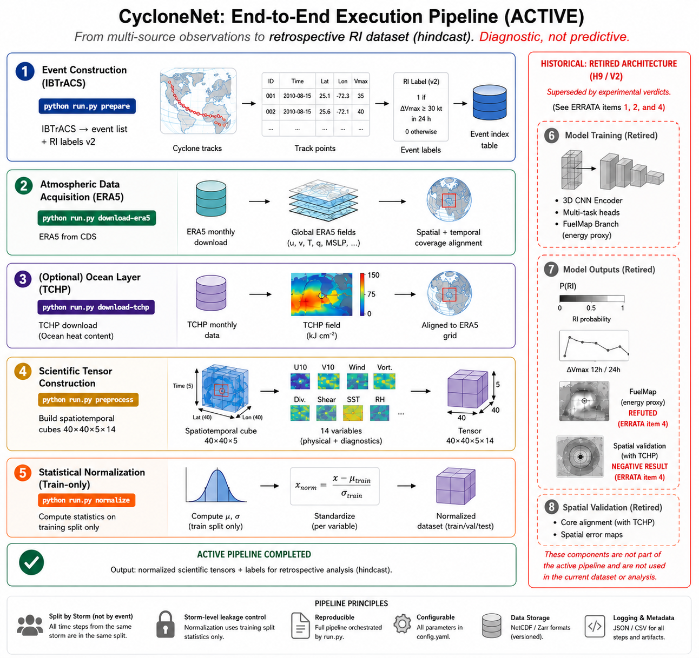

# CycloneNet: A Reproducible Pipeline and Leakage-Safe Two-Basin Dataset for Tropical-Cyclone Rapid-Intensification Analysis

<!-- PREPRINT DRAFT (Zenodo v3) — assembled 2026-07-16 from reviewed section drafts.
     Skeleton/spec: docs/manuscript_v3_skeleton.md. DOI slots (marked with brackets) pending Zenodo mint.
     Supersedes the record line v1.0.0 / v1.0.1 / v2.0.0 (corrections: Section 9).
     AUTHORITATIVE SOURCE: docs/cyclonenet_v3_preprint.tex (compiles to the published PDF).
     This file is a content mirror for review/diffing; prose edits must land in BOTH files.
     Structural extras (preamble, figure include, reference formatting, \slot macro) live in the .tex only. -->


## Abstract

CycloneNet is an open-source, configuration-driven pipeline for retrospective (hindcast) analysis of tropical-cyclone rapid intensification (RI) from ERA5 reanalysis and IBTrACS best tracks, released together with a two-basin dataset, leakage-safe with respect to storm-identity non-independence, spanning 1980–2023 (East Pacific and North Atlantic; 16,780 events from 992 storms: 799 RI positives, 15,962 negatives, 19 undefined labels under strict-temporal v2 labeling). The dataset employs storm-level hash-deterministic splits and train-only normalization to keep training and held-out sets independent at the storm level. Complete audit trails document byte-reproducibility of the RI labeling chain from raw IBTrACS; v1→v2 correction records show 148 of 32,989 rows misaligned (0.45%), zero valid-set label flips, and 19 events reclassified as undefined. The frozen test split (2,679 events; 112 RI positives, 6 undefined) is distributed and was not used by the pre-registered campaign reported below; the retired CNN's historical test-set metrics stand as record. A pre-registered campaign found that added pressure-level channels contributed no detectable skill (H6: null); under a global-average-pooling readout and intensity-blind input, the three-dimensional convolutional architecture produced no performance gain over a tabular baseline and is retired (H9: architecture not justified in its current form) — a verdict licensed for that architecture, not for whether spatial structure carries RI information. This version supersedes earlier claims in the project's public record line, with full corrections documented in Section 9. Code is released under MIT; dataset under CC BY 4.0.


## 1. Introduction

Tropical-cyclone rapid intensification (RI), defined as sustained wind increase ≥30 kt within 24 hours, remains one of the most challenging phenomena to forecast operationally. Understanding the environmental conditions that enable RI—and retrospectively diagnosing why a particular storm intensified rapidly—is essential for research and risk assessment. This work adopts a forensic (hindcast) framing: given a historical storm event and reanalysis-based environmental fields, which features are most consistent with the observed intensification? This is a diagnostic question, not a real-time forecast, motivating a dataset designed for reproducible, auditable analysis rather than operational deployment.

A persistent challenge in tropical-cyclone machine-learning studies is leakage between training and evaluation data. In event-based RI datasets, the dominant form is train/test non-independence through storm identity (Kapoor & Narayanan 2023, *Patterns*, 10.1016/j.patter.2023.100804): events of the same storm are strongly correlated, so event-level random splits let one storm's history span training and held-out sets. The present dataset is designed to be leakage-safe with respect to that vector through three design choices: (1) **SID-level assignment**—storms, not individual events, form the unit of train/validation/test partition, preventing the same storm's history from spanning training and held-out sets; (2) **deterministic and frozen test assignment**—the test split is assigned deterministically by SHA-256 hash of storm identifier, making the assignment invariant to dataset growth, and is further checked against a frozen map (`data/normalized/frozen_splits.json`) that preserves historical benchmark assignments; (3) **train-only normalization**—all feature standardization statistics (mean, variance) are computed on the training split only and applied identically to validation and test, preventing the held-out distribution from leaking into training-set preprocessing.

None of these three choices is novel, and this paper does not present them as such. Group-wise ("subject-wise") splitting is established practice with its own methodological literature, developed largely in digital health, where random record-level splits were shown to produce large underestimates of prediction error through identity confounding (Saeb et al. 2017; Neto et al. 2019); it is implemented in standard tooling, and this project uses scikit-learn's `StratifiedGroupKFold` for the development folds (Section 6). Hash-based deterministic assignment by identifier is a textbook technique (Géron 2019, ch. 2), motivated there by exactly the property relied on here — split membership that is stable as the dataset grows — and a feature request to add it to scikit-learn is open (scikit-learn issue #30992). Train-only normalization is elementary hygiene. What this release contributes is not the technique but the artifact: these choices applied, verified, and shipped for a sub-field whose released datasets do not implement them (Section 2).

These design decisions are formally verified in Section 5 (Technical Validation), which also states what the design does not control — the temporal axis (Section 8).

CycloneNet's development proceeded through a pre-registered evaluation campaign (registered and executed in July 2026) testing hypotheses about environmental channel utility and model architecture. The campaign yielded null or negative results on all central claims: added pressure-level environmental channels showed no detectable contribution to model performance (hypothesis H6: null result, confidence interval containing zero); the three-dimensional convolutional neural network architecture, when trained on equivalent input information and evaluated by identical protocols, demonstrated no advantage over a gradient-boosted tabular baseline and is retired from the validated pipeline (hypothesis H9: architecture not justified in its current form). Accordingly, this work designates no reference model; the validated contribution resides in the dataset and reproducible pipeline themselves.

This paper delivers four core elements: (1) the dataset—a two-basin RI event catalogue (16,780 events from 992 tropical cyclones spanning 1980–2023) engineered with storm-level leakage control and comprehensive audit trails; (2) the reproducible pipeline and code for reconstructing the complete dataset from raw ERA5 and IBTrACS sources; (3) results from the pre-registered evaluation campaign, including all hypothesis verdicts with confidence intervals and scope guards (Section 6); and (4) a complete correction record for the project's prior public releases (Section 9), documenting label revisions (v1→v2), non-reproducible metrics, and claims refuted or retired. Together, these constitute the research product: the data, the process, and the accounting of what did and did not work.


## 2. Positioning

### Established field: RI prediction and environmental controls

Rapid intensification of tropical cyclones is conventionally defined as a sustained-wind increase of at least 30 knots within 24 hours (Kaplan & DeMaria 2003), representing approximately the 95th percentile of 24-h intensity changes. The operational statistical baseline is the SHIPS Rapid Intensification Index (SHIPS-RII), in use since the early 2000s, built on linear discriminant analysis over environmental predictors and revised for multiple basins (Kaplan & DeMaria 2003; Kaplan et al. 2010).

The environmental conditions associated with RI are well-established and replicated across basins: low deep-layer vertical wind shear, high sea-surface temperature and ocean heat content (TCHP), high mid-level relative humidity, and favorable upper-level outflow (Kaplan & DeMaria 2003; Kaplan et al. 2015; Hendricks et al. 2010). However, a central finding in the field is that these conditions are necessary but not sufficient for RI: the environments of RI storms and of non-RI intensifying storms are statistically similar, and RI has been characterized as a "weak function" of large-scale environment with a stochastic component (Kowch & Emanuel 2015). The unexplained residual variance is attributed to internal inner-core processes—convective bursts, eyewall mesovortices, vortex-scale dynamics—and stochastic interactions between shear, the mean vortex, and convective bursts (Judt & Chen 2016). This remains the field's central open problem, not a gap this project discovered.

### Deep learning for RI: an active subfield

Deep learning for RI prediction is an active research area with recurring architectures: CNNs on reanalysis fields (Kim et al. 2024), CNN + gradient-boosting hybrids on ERA-Interim + scalar predictors (Wei, Yang & Sun 2023), and attention-based models on satellite imagery (Bai, Chen & Lin 2020). The frontier of tropical-cyclone intensity research has moved toward inner-core structure via high-resolution satellite imagery—beyond the resolution of 0.25° surface reanalysis. Reproducibility and benchmarking are established contribution categories in ML-for-meteorology; Bai, Chen & Lin (2020) released a public satellite-image RI benchmark dataset at ECML PKDD, demonstrating that auditable, released pipelines are a recognized venue separate from algorithm novelty.

### What this work contributes

This contribution lies in engineering and auditability, not physical discovery, algorithm novelty, or methodological novelty. Each practice this release applies is established elsewhere: group-wise splitting in digital health and clinical ML (Saeb et al. 2017; Neto et al. 2019); hash-based deterministic split assignment as textbook technique (Géron 2019); pre-registration in machine learning, which has had dedicated workshops with published proceedings since 2020 (Bertinetto et al. 2021; Albanie et al. 2022) and a treatment specific to predictive modeling (Hofman et al. 2023); per-artifact checksums and provenance manifests, for which a mature tooling literature exists. CycloneNet applies these to event-based RI prediction, with verifiable artifacts: hash-deterministic SID-level splits, frozen override map, and split-integrity regression tests. The claim is one of application and release, not of invention: we did not find these practices implemented in the released artifacts of this sub-field, which is a statement about the sub-field rather than about the practices. In most of those works, moreover, the storm-leakage problem is dissolved by design rather than left unaddressed: An & Jeong (2026), for instance, use one sample per storm, which makes storm-level leakage impossible by construction (1,044 rows, 1,044 unique storm identifiers in their released data). This release chose the event-based design — six-hourly samples along each track — where the problem is unavoidable and has to be engineered away; the controls exist here because the design requires them. The sub-field's evaluation norm is temporal — leave-one-year-out or year-based splits — which controls a different leakage vector (era mixing between training and test) that the storm-grouped design does not; the two designs are complementary, and the released artifacts carry per-event SID and timestamp so users can construct either (Section 8). The work is pre-registered with verdicts read once, and the data lifecycle is fully documented (SHA-256 checksums per window, basin-repair manifests, label-correction audit). The released dataset comprises 16,780 events from 992 storms (578 EP, 414 NA, 1980–2023 Jun–Nov) with strict-temporal, tri-state labels (799 RI+, 15,962 RI−, 19 NULL) stored as 40×40×5×14 cubes with 14 channels. Test split (2,679 events, 112 RI+) is frozen and released with splits and training-only normalization statistics. An & Jeong (2026, *JGR: Machine Learning and Computation*) released an ERA5-derived RI dataset on Zenodo (DOI 10.5281/zenodo.15833650), demonstrating that publicly released, peer-reviewed, reanalysis-derived RI datasets are an established practice.

### Boundary: SHIPS-RII and basin heterogeneity

SHIPS-RII is fitted separately per basin (Kaplan & DeMaria 2003; Kaplan et al. 2010). The current dataset is distributed as a two-basin ensemble (East Pacific and North Atlantic) without basin-stratified model development or evaluation. Meaningful comparison against SHIPS-RII requires basin-specific evaluation protocols; no such comparison is performed here. The basin heterogeneity—East Pacific and North Atlantic have distinct RI climatologies, seasonal patterns, and intensity distributions—is documented as a declared limitation.

### Dataset release: what differs

Reanalysis-derived tropical-cyclone datasets are an established data-journal genre (Xu et al. 2024, *Earth System Science Data*; Liu et al. 2025, *Scientific Data*), and a reanalysis-derived RI dataset has been released (An & Jeong 2026). Released ERA5-derived *spatial* products for TC tasks also exist: an ERA5/MERRA-2 patch dataset with its extraction library has been public since 2022 for TC-versus-background image classification (Gardoll & Boucher 2022, Zenodo 10.5281/zenodo.6881020), and ByteStorm tiles ERA5 maps into non-overlapping 40×40 patches labelled by presence of a TC centre (Donno et al. 2025, preprint) — the same patch size used here, for a different task.

What we did not find in this survey is the specific combination this release distributes: per-event spatio-temporal cubes from surface ERA5 alone, labelled for RI, with frozen hash-deterministic SID-level splits, tri-state labels with explicit NULL for undefined cases, and complete provenance documentation (per-window SHA-256 manifests, label-correction audit, basin-repair record). Each component has precedent; the assembled artifact is what is offered. Bai, Chen & Lin (2020), for example, already distribute pre-defined splits as files with their benchmark — frozen by distribution, with the split methodology undocumented; what we did not find released is the documented, hash-deterministic, storm-grouped assignment with a published override map and integrity tests. Its value is that it exists and is auditable, not that any part of it is new: the reproduction cost from source — ERA5 download, windowed extraction, quality control, and labelling — is what the release removes, together with the defects this project made publicly and corrected (Section 9) and which a re-implementation would encounter in private.

### What this work does not do

The dataset's 0.25° surface-level resolution cannot resolve inner-core structure, limiting spatial attribution fidelity; this is a physical limit of the input, not an algorithm choice. The project does not produce or recommend a reference model for operational or research use; the pre-registered campaign closed with null or negative architecture and feature-attribution hypotheses, and model development is concluded. No numerical comparison of this work's PR-AUC (0.249 on development out-of-fold) is offered against published results on other datasets and protocols; such comparisons are uninformative under different class distributions, task definitions, and feature sets. The dataset is released as a transparent, auditable baseline for RI research and as a record of a pre-registered campaign's negative results on spatial attribution and model-architecture questions.

## 3. Data

### 3.1 Repository and access

The dataset is published as an archived dataset record (dataset concept DOI — minted at publication) under the CC BY 4.0 license. See NOTICE for mandatory attributions; the analysis pipeline (github.com/estefano-ferreira/cyclone-net) is released under MIT. The released package contains 46 files totaling 6.03 GiB:
- 44 per-year cubic shards (organized in `cubes/` by year subdirectories)
- 1 metadata archive
- 1 checksums file

### 3.2 File inventory

| File pattern | Content | Quantity |
|---|---|---|
| `cubes/<year>/{event_id}.npy` | Per-event cube, shape (40, 40, 5, 14), float32, 448 KB each | 16,780 |
| `cubes/<year>/{event_id}.json` | Per-event metadata sidecar (§3.3) | 16,780 |
| `cubes/<year>/{event_id}_lats.npy` | Latitude grid (40-point array) for the window | 16,780 |
| `cubes/<year>/{event_id}_lons.npy` | Longitude grid (40-point array) for the window | 16,780 |
| `cubes/<year>/{event_id}_adt.npy` | ADT (Absolute Dynamic Topography) window; 2020–2023 only | 761 |
| `event_list_augmented.csv` | Complete labeled track-point list; superset of valid events | 32,989 rows |
| `valid_events.csv` | Summary: event_id, SID, storm_name, ri_label for the 16,780 released events | 1 |
| `splits.csv` | Train/val/test split assignment (70/15/15 by storm) | 1 |
| `frozen_splits.json` | Frozen override map ensuring split determinism and historical reproducibility | 1 |
| `normalization_stats.json` | Channel-wise statistics (mean, std, min, max) computed on train split only | 1 |
| `label_diff_v1_v2.csv` | v1→v2 label provenance and corrections for all 32,989 rows; reasons: unchanged, flip_misaligned, null_no_partner, dv_drift_only | 1 |
| `rejected_events.csv` | QC-excluded events (cubes not distributed); rejection-reason breakdown included | 1 |
| `provenance/*.json` | Processing-window, basin-repair, and label-correction manifests with MD5 checksums | 45 |
| `DATA_DICTIONARY.md`, `TECHNICAL_VALIDATION.md`, `NOTICE`, `LICENSE`, `CHECKSUMS.sha256`, `package_manifest.json` | Documentation and integrity records | — |

Event IDs follow the format `era5_YYYY_MM_DD_HHMM_<SID>` (UTC). The time axis T indexes as follows: index 0 = t₀ (event time), then −6 h, −12 h, −18 h, −24 h.

### 3.3 Cube schema and sidecar fields

Each valid event is stored as a float32 array of shape **(40, 40, 5, 14)** (spatial height, spatial width, time steps, channels). Accompanying each cube is a JSON sidecar containing the following fields:

| Field | Meaning |
|---|---|
| `event_id`, `sid`, `storm_name`, `basin` | Identity fields; `basin` is the per-point IBTrACS basin code (§3.5) |
| `timestamp` | Event time t₀ in UTC, format `YYYY-MM-DD HH:MM` |
| `center_lat`, `center_lon` | Storm center latitude and longitude at t₀ (from IBTrACS) |
| `wind_kt` | Best-track maximum sustained wind at t₀, in knots |
| `pressure_mb` | Central pressure if available; nullable |
| `dv12_kt`, `dv24_kt` | Intensity change (wind speed delta) at t₀+12h and t₀+24h, respectively; nullable if partner does not exist |
| `ri_label` | RI label ∈ {0, 1, null}; null denotes undefined (§3.6) |
| `channels`, `cube_shape`, `units` | Cube metadata: ordered channel names and their units (listed in §3.4) |
| `timestamps`, `era5_selected_times`, `era5_time_indices` | UTC timestamps and metadata for the 5 ERA5 records backing the T dimension |
| `qc_flags` | Quality control details: NaN fraction per channel (SST, MSL, u10, v10), SST range validation, MSL range validation, wind magnitude validation |
| `temporal_integrity_ok` | Boolean: all 5 timesteps are distinct ERA5 records (no duplicates or gaps) |
| `adt_saved`, `fuel_potential_saved` | Boolean flags indicating whether optional artifacts are present in this event's directory |
| `source_files` | ERA5 source file names from CDS (for provenance tracking) |

In the distributed package, `fuel_potential_saved` is `false` for all events. The underlying heuristic was unsupported and is not included; divergence from the local pipeline's internal sidecars is documented in `package_manifest.json`.

### 3.4 Channels (14 stored, variable consumption)

The cube's channel dimension (C = 14) is ordered as follows:

| # | Name | Unit | Source | Model input (historical)? |
|---|------|------|--------|---|
| 1 | `sst_K` | K | ERA5 single-level | yes |
| 2 | `mslp_Pa` | Pa | ERA5 single-level | yes |
| 3 | `u10_mps` | m s⁻¹ | ERA5 single-level | yes |
| 4 | `v10_mps` | m s⁻¹ | ERA5 single-level | yes |
| 5 | `wind_mps` | m s⁻¹ | Derived (√u10²+v10²) | yes |
| 6 | `vort_1ps` | s⁻¹ | Derived (∂v/∂x − ∂u/∂y) | yes |
| 7 | `div_1ps` | s⁻¹ | Derived (∂u/∂x + ∂v/∂y) | yes |
| 8 | `grad_mslp_Pa_per_m` | Pa m⁻¹ | Derived | yes |
| 9 | `sst_anom_K` | K | Derived (local mean removal) | yes |
| 10 | `latent_heat_flux_Wpm2` | W m⁻² | Derived (bulk formula) | **no** — stored only |
| 11 | `sensible_heat_flux_Wpm2` | W m⁻² | Derived (bulk formula) | **no** — stored only |
| 12 | `total_heat_flux_Wpm2` | W m⁻² | Derived | **no** (explicit config exclusion `exclude_total_heat_flux_from_input` — this channel fed the now-retired auxiliary loss and was kept out of the input set) |
| 13 | `shear_850_200_mps` | m s⁻¹ | ERA5 pressure levels [850, 200] hPa | tested; hypothesis H6: NULL |
| 14 | `rh_mid` | % | ERA5 pressure levels [700, 600, 500] hPa | tested; hypothesis H6: NULL |

Channels 1–9 were the channels used as model inputs in the project's experiments; ADT is an optional additional feature. The three heat-flux channels (10–12) are stored but not consumed as model inputs: latent and sensible heat flux were never inputs (retained for possible future use); total heat flux additionally carries an explicit configuration exclusion because it fed the now-retired auxiliary loss term — a training-objective concern, not a train/test one. Channels 13–14 were added during pressure-level backfill; hypothesis H6 formally tested their contribution and found no detectable skill gain at this resolution/regime (a documented null result, not an endorsement of their utility).

### 3.5 Basin semantics and the "NA" field

Each event's `basin` field contains the per-point IBTrACS basin code: either `EP` (East Pacific) or `NA` (North Atlantic). Six storms cross basin boundaries during their track; when attributing properties at the storm level (e.g., for storm-level grouping), use the genesis point. Of the 992 storms: 578 originated in the East Pacific, and 414 in the North Atlantic.

**CRITICAL READER NOTE:** The string `"NA"` (North Atlantic) is a categorical value, not a missing value. When reading any distributed CSV file with pandas, always specify `keep_default_na=False, na_values=[""]` to preserve it. Without this flag, `"NA"` entries are silently coerced to NaN, causing silent data loss. This bug pattern has occurred six times in this project's history (documented in Section 5.5).

### 3.6 Label semantics (v2: strict-temporal, tri-state)

The `ri_label` field is tri-state: 0, 1, or null.
- **ri_label = 1** if the 24-hour maximum sustained wind increase (ΔV₂₄) from t₀ to t₀+24h is ≥ 30 kt (Kaplan & DeMaria, 2003).
- **ri_label = 0** if ΔV₂₄ < 30 kt.
- **ri_label = null** if no exact temporal partner exists at t₀+24h (e.g., storm dissipated, reporting gap).

NULL is a label state, not a missing value; it denotes that the RI classification is undefined for that event. Readers must not coerce NULL to 0 and must exclude NULL events from RI-classification tasks (19 of 16,780 events).

Full label provenance is recorded in `label_diff_v1_v2.csv` (32,989 rows): per-row v1/v2 values, the correction applied, and the reason (unchanged, flip_misaligned, null_no_partner, or dv_drift_only). Complete audit, defect documentation, and correction statistics are in the Technical Validation section and the repository's ERRATA (items 6 and 8).

### 3.7 Population summary and splits

The distributed dataset comprises:
- **16,780 valid events** (6-hourly track points with a complete 24-hour ERA5 history window)
- **992 storms**: 578 EP genesis, 414 NA genesis
- **RI labels**: 799 positive (RI occurred), 15,962 negative (no RI), 19 NULL (undefined)
- **Event list**: 32,989 labeled track points (superset of valid events; excluded events are listed in `rejected_events.csv` with QC-failure reasons)
- **Temporal coverage**: 1980–2023, June–November (hurricane season only; no off-season tropical cyclones)
- **Spatial coverage**: 60°N–0°N latitude, 140°W–20°W longitude (East Pacific truncated west of 140°W; North Atlantic)

The frozen test split (never read during model development in this project; distributed for reproducibility) contains 2,679 events, of which 112 are RI-positive (v2 labels) and 6 are NULL. Train/val splits are assigned by storm (SID) via SHA256-deterministic hash into 70/15/15 proportions, with historical overrides applied via `frozen_splits.json`. No label stratification is applied; class proportions per split are approximate. Full split documentation and integrity tests are in Section 5.3.

### 3.8 Usage notes


When loading event metadata and labels from the distributed CSV files, readers must invoke `pandas.read_csv()` with the parameters `keep_default_na=False, na_values=[""]`. This is critical: the per-point basin attribute uses the literal string `"NA"` to denote North Atlantic, which collides with pandas' default NA sentinel list. Pandas' default missing-value parser destroys this distinction, conflating the basin identifier with NaN. This bug class—confusing `"NA"` string with missing data—occurred 6 times during this project's development and is the primary motivation for this requirement. Failure to set these flags will silently corrupt basin assignments and any downstream storm-level grouping.

For RI classification tasks, users must exclude the 19 events with NULL labels (represented as empty cells in CSV, `null` in JSON sidecars). NULL is a label state meaning *undefined* — not "no RI" — because the event occurs at storm end or during a tracking gap where the exact 24 h partner does not exist. Coercing NULL to 0 introduces label noise and violates the temporal integrity of the dataset. The reference implementation (`analysis/feature_ablation_kfold.py::load_dev_events`) demonstrates the correct filtering.

The frozen test split (2,679 events; 112 RI positives, 6 NULL) is distributed in `splits.csv` and `frozen_splits.json` for reproducibility and verification. However, the property "unread during model development" applies only to this project's historical development (documented in Technical Validation and the repository's provenance record). Once published, third parties may read the test set; benchmark comparability with this project's historical metrics therefore cannot be re-established by subsequent authors and is not claimed. Replication studies may use the public frozen split for consistency, but new performance claims should employ cross-validation or independent test sets to avoid circular benchmarking.

## 4. Methods

### Data Sources

The CycloneNet v2 dataset integrates three primary data sources: ERA5 reanalysis for environmental fields, IBTrACS best-track for storm positions and intensities, and supplementary ocean-heat validation products. 

**ERA5 Reanalysis.** Environmental data are from Copernicus CDS. Single-level: Hersbach, H., Bell, B., Berrisford, P., et al. (2018): ERA5 hourly data on single levels from 1940 to present. Copernicus Climate Change Service (C3S) Climate Data Store (CDS). DOI: 10.24381/cds.adbb2d47. Pressure levels: Hersbach, H., et al. (2018): ERA5 hourly data on pressure levels from 1940 to present. DOI: 10.24381/cds.bd0915c6. Data span 1980–2023, 0.25° resolution, 6-hourly, over [60°N, 140°W, 0°N, 20°W] (East Pacific + North Atlantic). Contains modified Copernicus Climate Change Service information (1980-2023). Neither the European Commission nor ECMWF is responsible for any use that may be made of the Copernicus information or data it contains. Raw monthly files are downloaded, extracted, verified, and discarded by design.

**IBTrACS Best-Track.** Storm positions, intensities, and rapid-intensification labels derive from the International Best Track Archive for Climate Stewardship (IBTrACS), Version v04r00 (Knapp, K. R., M. C. Kruk, D. H. Levinson, H. J. Diamond, and C. J. Neumann, 2010: The International Best Track Archive for Climate Stewardship (IBTrACS): Unifying tropical cyclone best track data. Bull. Amer. Meteor. Soc., 91, 363-376; NOAA National Centers for Environmental Information, Dataset DOI: 10.25921/82ty-9e16). Each 6-hourly track point defines an event.

**Ocean-Heat Validation Supplements.** Tropical Cyclone Heat Potential (TCHP; NOAA/AOML) and absolute dynamic topography (ADT; Copernicus Marine Service) are used exclusively for external validation (see repository documentation) and do not serve as model inputs.

### Event Definition

An event is a single 6-hourly storm-track point at time t₀, together with its 24-hour preceding ERA5 history. For each event, a 40×40 grid window (approximately 10°×10° at the event's latitude) is extracted from ERA5 centered on the storm's IBTrACS position, capturing five 6-hourly time levels: t₀, t−₆ₕ, t−₁₂ₕ, t−₁₈ₕ, and t−₂₄ₕ. This yields a spatio-temporal cube of shape (40, 40, 5, C), where C is the channel count. The complete chain is shown in Figure 1.

The dataset contains **16,780 valid events** from **992 tropical cyclones** (578 EP / 414 NA by genesis point). The per-point basin attribute is taken from IBTrACS; six storms cross basin boundaries during their track, recorded in the per-point basin field; genesis-basin attribution uses the first recorded point of each storm's IBTrACS record.



*Figure 1: End-to-end execution pipeline. The **active pipeline** (stages 1–5, left) terminates at the normalized dataset: it is a retrospective (hindcast) data-construction chain, not a forecasting system. Stage 1 builds the event list and the strict-temporal v2 RI labels from raw IBTrACS (Section 4.4); stages 2–3 acquire ERA5 and the optional ocean layer; stage 4 extracts the 40×40×5×14 cubes; stage 5 computes normalization statistics on the training split only. The **retired architecture** (stages 6–8, right, highlighted in red) is shown for historical completeness: the CNN, its outputs and the FuelMap spatial validation were superseded by the pre-registered verdicts of Section 6 (H9/V2) and by the refuted localization hypothesis (ERRATA item 4). They are not part of the active pipeline and are not used in the released dataset or in any analysis reported here.*

### Cube Channels (C = 14)

Fourteen channels are preserved: (1) nine model-input channels—SST, MSLP, U10/V10 wind, wind speed, vorticity, divergence, MSLP gradient, SST anomaly—derived from ERA5 single-level fields via finite differences; (2) three stored-only heat-flux channels (latent, sensible, total; W/m²), computed and stored but not consumed as model inputs (the total-heat-flux channel carries an explicit configuration exclusion tied to the retired auxiliary loss); and (3) two tested supplementary channels—shear (850–200 hPa) and mid-level relative humidity (700–600–500 hPa)—from ERA5 pressure levels. These were formally tested (H6 hypothesis) and found to contribute no detectable skill; they are retained for reproducibility.

### Label Semantics (v2, Strict-Temporal with Tri-State)

Rapid intensification is defined as a ≥30 knot increase in maximum sustained wind over exactly 24 hours (Kaplan & DeMaria 2003). For each event at time t₀, the label is determined by identifying the **exact temporal partner**: the IBTrACS record for the same storm at precisely t₀ + 24 hours (no tolerance window). If such a partner exists, `ri_label` = 1 if the 24 h wind change (dv24) ≥ 30 kt, else 0. If no exact partner exists—at storm dissipation, in reporting gaps, or at the dataset's temporal boundary—the label is `NULL` (undefined), **never coerced to 0**. This tri-state semantics (0, 1, NULL) prevents label artifacts from temporal discontinuities.

The dataset contains **799 RI-positive events (dv24 ≥ 30 kt), 15,962 negatives, and 19 undefined events** (out of 16,780 valid events). 12-hour deltas (dv12) are computed analogously for supplementary analysis.

**v1→v2 Correction.** The previous release (v1) computed dv24/dv12 by positional row shifts (−4/−2 rows, assuming perfect 6-h regularity in the track table). This method misaligned 148 of 32,989 raw track points (0.45%). Corrected v2 labels use exact 24 h temporal partners with no positional assumptions. The correction reclassified 19 valid events to NULL (storm end or reporting gaps); positives decreased from 802 to 799 (−3, all in the test split, via NULL reclassification). A full per-row provenance record (`label_diff_v1_v2.csv`) is distributed, mapping each event's v1 and v2 labels and the correction reason (unchanged, flip_misaligned, null_no_partner, dv_drift_only). The audit details are recorded in the repository's ERRATA and TECHNICAL_VALIDATION documents.

### Quality Control

Events are subject to per-cube quality-control checks:

- **Physical ranges:** SST ∈ [240, 330] K, MSLP ∈ [80000, 110000] Pa, wind speed ≤ 80 m/s.
- **NaN budgets:** events are rejected if more than 50% of any single-channel grid is NaN.
- **Temporal integrity:** all five time levels must correspond to distinct ERA5 records (no timestamp collapse).
- **Geospatial integrity:** the storm center (from IBTrACS) must lie within the extracted 40×40 window; events where the center falls outside are rejected.

Rejected events are catalogued in `rejected_events.csv` with their exclusion reason and are **not distributed** (their cubes are not packaged). This transparency allows users to audit the filtering threshold and verify that a desired event was either included or intentionally excluded.

### Normalization

Training-set statistics (channel-wise mean and standard deviation) are computed over the 70% training split **only**, using all spatial and temporal grid points in training events. These statistics are applied to all subsequent splits (validation and test) and distributed in `normalization_stats.json`. Per-channel statistics ensure that each feature is zero-centered and unit-scaled consistently. This train-only normalization prevents the test split statistics from influencing model training — the held-out-distribution vector described in Section 5.3.

### Splits: Hash-Deterministic with Frozen Override

Events are partitioned into train (70%), validation (15%), and test (15%) splits at the **storm level** using the SHA256 hash of each storm's identifier (SID). No storm appears in more than one split, preventing train/test non-independence through storm identity. The hash-deterministic scheme ensures that adding new storms to the dataset never reassigns existing storms to different splits.

A **frozen override map** (`frozen_splits.json`) is consulted first during split assignment, preserving historical benchmark assignments. The SHA256 hash rule assigns any storm not in the frozen map, ensuring deterministic composition invariance as new storms are added. Split composition: **train** 11,150 events; **validation** 2,951 events; **test** 2,679 events, comprising 112 RI-positive and 6 NULL labels. No label stratification is applied. The test split is frozen (never read during this project's model development); once published, external researchers may read it, but this project does not assert external benchmark-replicability (see Section 3.8).

### Windowed Processing and Provenance Manifests

Raw ERA5 monthly files are downloaded, extracted per-event, verified, and **discarded by design**—a choice balancing storage practicality with provenance rigor. Each processing window generates a manifest (JSON) recording source-file SHA256 hashes, per-event extraction outcomes, and deletion timestamps. These manifests form an immutable audit trail linking every released cube to its source file and enabling byte-level replication. Basin-repair and label-correction manifests document all transformations. The labeling chain (raw IBTrACS → event labels) is byte-reproducible via deterministic recomputation with an abort-on-mismatch replication gate.

### Reconstruction


The event list and RI-label chain are byte-reproducible from raw IBTrACS; the geospatial cubes are reconstructible by re-downloading ERA5 from Copernicus CDS using the configuration file `config-template.yaml` and the pipeline orchestrator `run.py`. The recommended command sequence is:

```
python run.py prepare           # Download IBTrACS; generate event list and RI labels
python run.py download-era5     # Fetch ERA5 monthly files from Copernicus CDS
python run.py preprocess        # Extract 40×40×5×14 cubes with 14 channels
python run.py normalize         # Compute train-split-only normalization statistics
```

No credentials are stored in the repository; the CDS API key lives in `~/.cdsapirc` (see the setup instructions in `README.md`). Raw ERA5 files are not distributed (discarded after verified extraction by design); provenance manifests in `outputs/provenance/` document the windowed processing. Full verification of the labeling chain against raw IBTrACS is available via the replication-gate script `analysis/dv24_impact_assessment_v5_raw_reference.py`, which aborts on any mismatch and certifies byte reproducibility.


## 5. Technical validation

### 5.1 Byte-reproducibility of the labeling pipeline

Reconstruction of the 32,989-row event list from the raw IBTrACS archive reproduces the shipped file **byte-for-byte** (32,989/32,989 rows with identical dv24 and ri_label values on every row). The labeling chain applies synoptic-hour filtering, per-storm intensity-change calculation, and target dropna. Script `analysis/dv24_impact_assessment_v5_raw_reference.py` performs exact replication and aborts unless byte-for-byte match is achieved — the project's permanent "replication gate" for all defect diagnoses.

### 5.2 Label correction from v1 to v2, fully audited

The v1 labels were computed using positional shifts (−4 rows for dv24, −2 rows for dv12), assuming perfect 6 h regularity in the best-track archive. When measured against raw IBTrACS on the full population, **148/32,989 rows (0.45%) show misalignment** where the positional partner is not at the canonical temporal offset. Critically, **zero label flips occurred in the released valid set**. Under strict-temporal semantics (partner = exact match at t0 + 12 h or t0 + 24 h), **19 valid events have no temporal partner and are reclassified as undefined (NULL)**; as a result, RI positives decreased from 802 to **799**. All corrections were made at the source in `src/processors/ri_labeling.py` (temporal join, nullable Int64) with per-file verification and full per-row provenance documented in `label_diff_v1_v2.csv`. The authoritative impact assessment (`outputs/results/dv24_impact/report_v5_20260716_152525.*`) supersedes earlier intermediate reports.

### 5.3 Split integrity and leakage safety (proof of title claim)

The title's "Leakage-Safe" claim refers to the storm-identity vector and is supported by this subsection; its boundary — the temporal axis — is stated at the end of this subsection and in Section 8. Splits are assigned at the storm (SID) level using SHA256-hash-determinism with a frozen override map; **no storm crosses between train, validation, or test splits**. Property-tested via `tests/test_splits_stability.py`, these assignments are invariant to dataset composition and preserve the historical benchmark. Events lacking a storm assignment fail loudly (no silent exclusion). The development set (all model work and hypothesis testing) comprises 14,101 events across 839 storms. By SID, the full dataset is divided 70/15/15 into train, validation, and test, yielding 2,679 test events (112 v2-positives, 6 NULL). **Train-only normalization** (coefficients computed on training split only; `normalization_stats.json`) prevents information leakage from scaling statistics. Together, SID-deterministic splits with frozen override and train-only normalization control the vectors this design addresses: train/test non-independence through storm identity (no storm's events span splits) and held-out-distribution influence on preprocessing statistics. The design does **not** control the temporal axis: the SID hash assigns storms from all decades to all splits, so training and test mix eras. Temporal designs (leave-one-year-out or year-based splits) control exactly that vector and are complementary to the storm-grouped design (Section 8).

### 5.4 Pressure-level completeness census

Following the 1980–2019 pressure-level backfill campaign (21,662 events processed through 20 windowed extraction stages, zero failures, with per-window provenance manifests), an independent census confirmed **100% coverage of the development set: 14,101/14,101 events** carry both pressure-level channels (`shear_850_200_mps` and `rh_mid`, DATA_DICTIONARY §4). The result (`outputs/results/pl_gate_census.json`) gates every downstream experiment.

### 5.5 Processing provenance and basin metadata repair

Raw ERA5 monthly files (≈57 GB in total, measured from the per-window provenance manifests: ≈24 GB of single-level fields over 22 windows, 1980–2023, and ≈33 GB of pressure-level fields over 20 windows, 1980–2019) are not retained in the release; they are discarded exclusively through a windowed extraction process in which every compressed field is verified before deletion, with a provenance manifest per window recording row counts, field checksums, and source-file sizes. Basin metadata was audited and repaired in July 2026 following discovery of a pandas NA-parsing bug that had silently converted the literal "NA" (North Atlantic) basin code to empty string in all intermediate artifacts. Post-repair verification confirms **8,888 East Pacific / 7,892 North Atlantic over 16,780 valid events** (per point); by storm genesis basin, **578 EP / 414 NA over 992 storms**. The bug class recurred across the project's own readers — six documented occurrences in the project's history, the last of them a reader that worked only because a downstream workaround masked the value its own read had destroyed. A class-wide remediation sweep then audited every reader and fixed seven beyond the origin parser (including latent instances that had not yet caused damage), added regression tests (`tests/test_na_handling_readers.py`), and standardized all readers on `keep_default_na=False, na_values=[""]` to preserve "NA" as a literal string.

### 5.6 Quality control and rejected events

Per-event QC occurs at extraction, testing physical ranges (SST ∈ [240, 330] K, MSLP ∈ [80000, 110000] Pa, wind ≤ 80 m/s), NaN budgets (allowable sparsity per channel), and temporal/geospatial integrity (monotonic timestamps, bounding box compliance). QC flags are stored in each event sidecar JSON. Events failing QC are listed in `rejected_events.csv` and excluded from all cube arrays. Normalization statistics (`normalization_stats.json`) are computed exclusively on the training split, preventing inadvertent test-time information leakage through scaling coefficients.

### 5.7 Usability evidence

A gradient-boosted baseline trained on tabular features derived from the data cubes (stratified group k-fold by SID — StratifiedGroupKFold, k=3 — over the development set, pooled out-of-fold) attains **PR-AUC ≈ 0.25** against a positive base rate of **4.8%**, demonstrating that the labels support supervised learning despite the modestly imbalanced class distribution. The retired convolutional neural network architecture, historically evaluated on a frozen test set under v1 labels (2,679 events, 115 RI positives; 112 positives under the v2 recount), attained **ROC-AUC 0.796 [95% CI 0.753–0.837], PR-AUC 0.251 [0.179–0.331], recall 0.852** — reported here exclusively as a historical benchmark record and proof-of-concept that the labels admit neural learning; this architecture is retired and its evaluation protocol is separate from current development. Model comparisons, hypothesis verdicts, ablation studies, and operational guidance reside in `BENCHMARK.md` and `hypothesis_registry.md`; the pre-registered campaign is reported in Section 6.

### 5.8 Retraction discipline: the wrong-reference lesson and permanent replication gate

An intermediate assessment (2026-07-16) diagnosed "cross-SID label leakage with 84 phantom positives, 12 storms losing all positives, and 3,062 undefined labels (18.2% of the valid set)" — **the diagnosed defect does not exist**. Reconstruction from raw IBTrACS refuted it entirely. The error arose because the diagnosis operated on a derived artifact (`data/event_list_augmented.csv`) from which the builder's dropna operation had already removed the partner rows used in the original label computation. On that file, the states "partner row never existed" and "partner row was created and then dropped" are indistinguishable, causing legitimate trailing-row labels to appear as cross-storm leakage. The supporting "global shift" evidence (959/5,829 matches, 16% correspondence) was coincidental collision of 5 kt-quantized deltas, not systematic leakage (genuine leakage would show ~100% match rate). **The lesson:** arithmetic consistency across analytical scopes does **not** detect wrong-reference errors; numbers can agree with each other while measuring the wrong thing. **Consequence:** the **raw-replication gate** (reconstruct all shipped artifacts byte-exactly from raw sources; abort on any mismatch) is now a permanent project rule (PROJECT_STATE §3) — every defect diagnosis on derived artifacts must first pass this gate. This discipline is a strength of the validation story, not a limitation: it rendered the false diagnosis discoverable through direct measurement and ensures that all remaining claims rest on direct evidence from the authoritative source.


## 6. The pre-registered campaign

### 6.1 Protocol

The modeling campaign was conducted under pre-registration discipline. Pre-registration is not new to machine learning: NeurIPS hosted dedicated pre-registration workshops in 2020 and 2021, with published proceedings (Bertinetto et al. 2021; Albanie et al. 2022), themselves following an earlier trial in computer vision, and its application to predictive modeling has been treated directly (Hofman et al. 2023). What is reported here is its application to an RI study, not the practice itself. All three hypotheses (H6, H8, and H9 — the last with two co-primary verdicts, V1 and V2) were registered in `docs/hypothesis_registry.md` with decision rules fixed before any result was consulted. Three dedicated pre-registration documents were committed to the repository before training commenced:

- `docs/ablation_preregistration.md` (H6: shear and mid-level RH feature ablation)
- `docs/fuelmap_ablation_preregistration.md` (H8: physics loss ablation)
- `docs/tabular_baseline_preregistration.md` (H9: CNN vs. tabular baseline)

Each confidence interval was read once. No re-runs, re-thresholding, or branch re-examination occurred after the initial reading. The verdicts and their fixed pre-registered consequences are recorded in the hypothesis registry and in the archived result artifacts (JSON reports dated 2026-07-16).

All experiments were conducted on development folds only (PL-gated development set: 14,101 events, 687 positives, 839 storms). The measurement protocol was consistent across all arms: 3-fold stratified group k-fold cross-validation by storm ID (SID) with 3 random seeds (42, 123, 456). Pooled out-of-fold PR-AUC is reported as the mean across the three seeds. **The frozen test set (2,679 events, 112 RI positives under v2 labels, 153 storms) was not read, touched, or used by any component of this campaign.** Historical CNN test-set metrics (PR-AUC 0.251, see BENCHMARK.md) were read once and stand as the record of that retired model.

### 6.2 The ladder

Development-fold out-of-fold PR-AUC was measured for four modeling approaches on the standard information diet and training protocol (15-epoch budget, identical fold splits, 3 seeds). Table 1 reports the pooled mean across seeds.

| Model | Information diet | Pooled OOF PR-AUC (mean of seeds 42, 123, 456) |
|---|---|---|
| GBM S | Storm state only (Vmax, persistence, latitude, season, basin) | **0.202** |
| GBM F | Field aggregates only (mean/std/min/max of 11 cube channels) | **0.170** |
| CNN | Full-resolution spatial fields (intensity-blind, global average pooling) | **0.171** |
| GBM SF | State + field aggregates (complete tabular baseline) | **0.249** |

The ladder shows a consistent ranking: when the tabular model accesses both state and field information (SF), it reaches 0.249. The CNN, despite receiving full spatial resolution, achieves 0.171 — statistically indistinguishable from the F-only aggregate baseline (the H9/V2 comparison below). The S-only state model achieves 0.202, establishing the information value of persistent variables alone.

### 6.3 The four verdicts

The three hypotheses produced four verdicts: H6, the two co-primary H9 verdicts (V1 and V2), and H8's cancellation. Each is stated exactly as registered. The two co-primary H9 verdicts shared a single resampling procedure (10,000 bootstrap resamples); their confidence intervals were read together on 2026-07-16 and are not subject to re-interpretation.

#### H6: Shear and mid-level RH feature addition

**Verdict: NULL.** Cross-seed mean ΔPR-AUC (addition of shear_850_200_mps and rh_mid to the 9-channel baseline) = +0.0185, 95% CI [−0.0070, +0.0431] includes zero. Per the pre-registered reading: the added channels deliver no detectable skill at this resolution and regime for this architecture. This is not reinterpreted as a weak positive; the registration forbids that reframing. The candidate mechanisms (deep-layer wind shear disruption of the warm core; mid-level dry air suppression of convection) are established in the literature and were confirmed in the matched-pairs precursor analysis (H4/H5 positive verdicts), but their inclusion in the input set yields no measurable gain when fed to this estimator.

#### H9/V1: CNN validity versus tabular baseline

**Verdict: NEGATIVE.** Δ₁ = PR-AUC(CNN) − PR-AUC(GBM_SF) = −0.0781, 95% CI [−0.1162, −0.0422] < 0, with per-seed deltas of −0.079, −0.072, −0.083. The tabular baseline beats the CNN. Pre-registered consequence: the CNN is not justified over a classical gradient-boosted baseline on this dataset and protocol. The tabular model (GBM_SF) becomes the empirical reference for development-fold performance; however, it was never evaluated on the frozen test set and is not promoted as a reference model for the project.

#### H9/V2: CNN architecture justification at fixed information diet

**Verdict: NULL.** Δ₂ = PR-AUC(CNN) − PR-AUC(GBM_F) = +0.0005, 95% CI [−0.0285, +0.0316] includes zero, with per-seed deltas of −0.007, +0.014, −0.005. At a fixed information diet (field aggregates only), the full-resolution spatial grids provide this CNN no detectable advantage over 44 scalar statistics. Pre-registered consequence: the architecture is not justified in its current form and is retired. Any redesign of the spatial encoder requires a new pre-registered campaign.

#### H8: Physics loss component ablation

**Verdict: CANCELLED.** The pre-registered H8 question (whether four loss-term components shaped toward a heuristic prior improve classification) became undecidable once H9/V2 retired the architecture those terms were designed to regularize. Ablating a component of a retired model decides nothing about that component's utility. Per the pre-registration, the harness (`analysis/fuelmap_ablation_cnn.py`) and its documentation remain in the repository as historical record and are not to be executed.

### 6.4 Ex-ante qualifications

The following constraints on the verdicts were registered before reading any result. None were invented after:

1. **Global average pooling (GAP).** The CNN pools all spatial information before the classification layer, reducing the 40×40 spatial structure to a global vector. CNN ≈ GBM(F) performance was expected *of this architecture* and is not surprising. The scope guard is strict: this verdict does not establish whether spatial structure in the fields carries RI information — only that this CNN's aggregation pattern does not extract it. A future CNN with spatial-attention or hierarchical output could break this symmetry and requires a new pre-registration.

2. **Intensity-blind inputs.** The CNN receives no Vmax or persistence; GBM_SF does. The V1 gap (−0.078) conflates information diet and model class. The S−F difference (≈ +0.03) quantifies the state-only contribution to the tabular baseline, establishing how much of the gap stems from information rather than architecture.

3. **Basin one-hot.** The basin predictor in the GBM feature table arrived mislabeled (`basin_EP` / `basin_`, an empty string) due to a parsing bug corrected in the repository (ERRATA.md item 7). The two mislabeled columns carried the true two-basin partition (99.9% correspondence at the event level), and the GBM effectively used basin membership as a predictor. The CNN receives no basin input. This asymmetry is a component of the V1 gap independent of spatial-field information.

4. **15-epoch training budget.** Identical across all arms and all CNN cells in the k-fold experiment, fixed in the pre-registration to avoid adaptive hyperparameter tuning.

### 6.5 Scope guard

Verbatim from the pre-registration registry:

> V2 speaks about THIS model, not about whether spatial structure carries information. A stronger spatial reader could extract what this CNN cannot. The claim licensed is about the architecture, not the physics.

Additionally, two boundaries these verdicts do not cross:

- The H9 baseline is a gradient-boosted model trained on this project's own released data. Comparison against operational RI prediction baselines (e.g., SHIPS-RII) has not been performed and remains a precondition for any operational skill claim.
- Per the scope guard, none of these verdicts establishes that spatial structure in the 0.25° surface fields carries RI information — only that this global-pooling CNN did not extract it.

## 7. Discussion

The pre-registered campaign measured whether spatial fields add RI prediction skill beyond aggregated storm state and environmental scalars, using three hypothesis tests on a PL-gated development set of 14,101 events (687 positives). The measurement ladder reports pooled out-of-fold PR-AUC (mean of three random seeds): GBM_S 0.202 (state only), GBM_F 0.170 (field aggregates only), CNN 0.171 (full spatial fields, intensity-blind), GBM_SF 0.249 (state + field aggregates), and logistic regression on the strongest tabular feature set at 0.203. The four verdicts follow.

**H6 (feature ablation) was NULL:** adding shear and mid-level RH to the current 9-channel baseline yielded a cross-seed ΔPR-AUC of +0.0185 with 95% confidence interval [−0.0070, +0.0431], including zero. These two established SHIPS-predictive channels provided no detectable skill increment at this resolution and regime for this architecture. The null does not establish that the channels carry no signal — it establishes that this architecture does not extract it.

**H9/V1 (validity) was NEGATIVE:** the 3D-CNN (full-resolution spatial fields, globally average-pooled before classification) scored 0.171 OOF PR-AUC against the tabular baseline's 0.249, yielding Δ₁ = −0.0781 [95% CI −0.1162, −0.0422]. The classical baseline outperformed the spatial model. This verdict has fixed consequences: the CNN is not justified over a SHIPS-like tabular baseline on this data.

**H9/V2 (architecture justification) was NULL:** at identical information diet — 44 aggregated scalars (field statistics) fed to both CNN and tabular models — the CNN and GBM_F scored 0.171 and 0.170 respectively, yielding Δ₂ = +0.0005 [95% CI −0.0285, +0.0316]. Full 0.25° spatial grids conferred no detectable advantage to this architecture over simple field statistics. This verdict has fixed consequences: the architecture was retired; any redesign is a new pre-registered test.

**H8 (physics-loss ablation) was CANCELLED:** the test sought to measure whether four physics-penalty terms improved the CNN's classification objective independent of the spatial attribution claim (which H1 had refuted). However, H9/V2's verdict retired the architecture carrying those losses. Ablating a component of a retired model decides nothing. The pre-registration and harness remain in the repository as record; the test is not to be executed.

These verdicts close the architecture question **for this configuration**: a 3D-CNN with global average pooling, 9 or 11 input channels, and no intensity inputs, evaluated on 0.25° ERA5 surface reanalysis over two ocean basins with different RI climatologies. The question is not closed for alternative CNN designs — a deeper spatial reader, a state-CNN fusion branch, or a multi-basin decomposition could extract what this model cannot. Each such redesign requires a new pre-registration, not an amendment to this one.

The tabular-vs-spatial result — CNN ≈ GBM(F) at fixed information diet — is licensed to mean: "this architecture does not justify its complexity." It does **not** license the stronger claim that spatial structure carries no RI signal in the data. That claim would require examining whether other architectures (e.g., attention mechanisms, variable receptive fields, or physics-informed spatial convolutions) extract information this one misses. The scope guard is fixed: the verdict speaks to the model, not the physics.

Why does the project designate no reference model? The CNN has a frozen test-set read (PR-AUC 0.251 [0.179–0.331]; 2,679 events, 115 positives at the time of the read, 112 under the v2 recount), but was retired by H9/V2's pre-registered verdict. The GBM_SF is the empirical reference on the development folds (0.249 pooled OOF, 14,101 events / 687 positives) and has never been evaluated on the frozen test set — promoting it would require a second test-set read, which the released contribution does not justify. The released contribution is the dataset (16,780 valid events across 1980–2023 and two ocean basins), not a production model. Both test-set and dev-fold results are reported with their protocols explicitly separated and their scope guards stated: test-set metrics stand as the historical record of a retired architecture; dev-fold metrics measure hypothesis verdicts on a held-out development set.

What does the dataset support next? The project records a living hypothesis registry documenting physical directions that cannot be tested with 0.25° surface reanalysis: inner-core convection (convective bursts and eyewall dynamics), high-resolution ocean structure (warm-core eddies and eddy-driven TCHP anomalies), and spatial residuals after accounting for surface conditions. Each requires data beyond the current resolution or coverage — satellite-derived inner-core structure, ocean-model eddy fields, or multi-year high-resolution ocean-heat gridded data. These are registered as future agenda, not open hypotheses of this project. They are established physics, not discoveries awaiting to be made here.

The dataset itself is the entry point for three practical directions: (1) model redesign with pre-registration (alternative architectures, multi-basin control, or physics-informed spatial structure); (2) RI precursor validation in matched-pairs or time-series designs (H4 and H5 confirmed classic SHIPS predictors — shear and humidity — but do not guarantee their incremental value for classification); (3) two-basin heterogeneity study (the dataset mixes East Pacific and North Atlantic, which have different shear and TCHP climatologies, at 578 vs 414 storms by genesis basin, with per-point splits of 8,888 EP / 7,892 NA across the valid set). A per-basin analysis is under-powered with the current 687 development positives, but future data expansion may enable it. None of these next steps are forward-looking promises — they are pointers to the registered agenda and to known limitations documented in Section 8.


## 8. Limitations

1. **Seasonal coverage.** The dataset spans only June–November (hurricane season); no off-season tropical cyclones are included.

2. **Spatial coverage and basin scope.** The dataset covers East Pacific (truncated west of 140°W) and North Atlantic basins only (60°N–0°N, 140°W–20°W), with events sampled at 6-hourly resolution from 1980–2023. Other basins (Western Pacific, Indian Ocean) and decades outside this window are absent.

3. **Intensity metadata provenance.** All intensities are derived from IBTrACS, which follows USA-agency-centric reconciliation practices. Agency metadata differences and alternative reconciliation strategies are unrepresented; users working with non-USA track data should audit for potential bias.

4. **Undefined labels.** Nineteen events carry NULL labels (undefined) because their 24-hour temporal partners do not exist (at storm dissipation or during reporting gaps). These events must be excluded from RI-classification tasks; NULL is a label state denoting undefined classification, not absence of RI.

5. **Surface-only measurements.** The nine model-used channels capture surface and near-surface fields (SST, 10 m wind, MSLP, and derived products) only. The dataset does not include subsurface ocean fields (which govern sustained RI thermodynamics) or the atmospheric column (deep-layer shear, mid-level humidity) that operational forecasters exploit. Pressure-level channels (shear at 850–200 hPa and relative humidity at 700/600/500 hPa) were collected and formally tested (H6 hypothesis); they were found to contribute no detectable skill in this dataset and are retained for reproducibility but not used for model training.

6. **Spatial resolution.** ERA5 at 0.25° resolution cannot resolve inner-core structure; the dataset's channels derive from bulk reanalysis fields, limiting spatial attribution fidelity at the storm scale.

7. **RI-classification skill, honestly framed.** The baseline gradient-boosted tabular model, evaluated on development folds (14,101 events, 687 positives, pooled out-of-fold), achieves PR-AUC ≈0.25 against the valid set's base rate of 4.8% (approximately 5× chance), providing usability evidence that the dataset's labels support supervised learning. This lower bound does not imply a performance ceiling; lower bounds are not ceilings. The dataset's skill should not be extrapolated beyond this development evidence without independent test-set replication. No comparison against operational baselines (e.g., SHIPS Rapid Intensification Index) has been performed; such comparison is necessary before any operational skill claim. SHIPS-RII is fitted separately per basin, and direct inter-model comparison with a two-basin model requires basin-stratified evaluation to be meaningful.

8. **Two-basin heterogeneity.** East Pacific and North Atlantic exhibit distinct RI climatologies, seasonal patterns, wind-shear regimes, and intensity distributions. This heterogeneity is not controlled (basin is not used as a covariate in the pipeline) and is not balanced across splits; users performing inter-basin comparisons should account for basin nesting explicitly.

9. **Temporal axis not controlled by the split design.** The SID-hash split controls storm-level non-independence but assigns storms from all decades (1980–2023) to all splits: training and test mix eras. The sub-field's temporal evaluation designs (leave-one-year-out or year-based splits) control exactly that vector, which Kapoor & Narayanan (2023) classify separately from sample non-independence. The two designs control different leakage vectors and are complementary; this release ships the infrastructure for both — every event carries its SID and its timestamp, so year-based splits can be constructed directly. A leave-one-year-out sensitivity analysis on this dataset would be a new pre-registration, not an amendment to this campaign.

10. **Label-correction provenance.** The transition from v1 to v2 labeling (strict-temporal partner matching versus positional-shift assumptions) corrected 148 of 32,989 raw track points (0.45%) for temporal misalignment. Zero label flips occurred in the released valid set; 19 valid events were reclassified as NULL (no temporal partner). Complete per-row provenance and correction reasons are documented in `label_diff_v1_v2.csv` and are fully auditable via the byte-level replication-gate script (`analysis/dv24_impact_assessment_v5_raw_reference.py`).

## 9. Correction record

This paper supersedes the project's prior public releases: v1.0.0 (10.5281/zenodo.18571958), v1.0.1 (10.5281/zenodo.18577056), and v2.0.0 (10.5281/zenodo.18751255), which form a single concept line (verified 2026-07-16: `/latest` resolution of both v1 records points to v2.0.0). Version-DOIs preserve the old records as permanent historical documents. This section documents corrections across the entire line.

The superseded record line also produced the system this release distributes: the extraction chain, the labeling code, and the pipeline were developed across the v1 and v2 cycles. Earlier releases had confidence intervals spanning chance; the v2-era diagnostic — that the bottleneck was sample size — was confirmed by intervention: the archive was expanded roughly 17-fold (972 → 16,780 valid events), after which both test-set AUC confidence intervals sit entirely above chance (ERRATA item 3 below). The pre-registered campaign that retired the claims below ran on the data those versions constructed.

### Claims from v1.0.0 and v1.0.1 (February 2026)

The v1 records, titled *"CycloneNet: A Deep Learning Framework for Atmospheric Singularity Mapping via Spatio-Temporal Attention,"* claimed:

- **ROC-AUC 0.97 and Recall 0.92** and **"sub-pixel spatial accuracy"**: text in v1-era README.md and BENCHMARK.md (commit 93e2b2f–93934d8), removed at v2 rewrite. No metrics artifact in any versioned tree; at v1-era state (commit ee3296c), the repository contains no evaluation output files. Text claims without supporting artifacts.
- **"~26 km mean spatial error" and "18 hurricanes (1989–2024)"**: not reproducible from any released artifact; origin not determinable from the repository or its history.
- **"Target Lock"** (as branding): removed at v2 rewrite; survives only as technical descriptor of `pred_lat`/`pred_lon` in validation documentation.

None of these claims should be cited. The reproducible chain that replaces them is documented below (the v2.0.0 claims and ERRATA item 3).

### Claims from v2.0.0 (February 2026)

The v2.0.0 preprint made five classes of claims now superseded or corrected:

**Physics-guided losses (ERRATA item 1).** The paper described a model "physics-guided" via FuelMap-alignment and equation-consistency losses. The released code did not define the `training.physics.*` loss weights, so every term defaulted to 0.0 — the model was a plain CNN with no active physics constraint. Corrected in the released code; the equation-consistency term is near-degenerate by construction and disabled by default. The "physics-guided" label is retired from the project's citable identity; class names retain historical identifiers for reproducibility only.

**Threshold methodology (ERRATA item 2).** The paper stated a validation threshold targeting recall ≥ 90% applied unchanged to the test set. The released code selected the threshold by maximizing F1, not by the stated recall target. This is now corrected to follow a configurable policy honoring the stated forensic high-recall intent.

**Headline metrics (ERRATA item 3).** The paper reported ROC-AUC 0.83 / recall 0.905 on 2,193 test samples (211 RI positives). These were never reproducible from the public artifacts; the public release covered only 2020–2023 (972 events; test split 155 samples, 9 positives). **These numbers are superseded and should not be cited.** The reproducible numbers, from the released full 1980–2023 dataset (16,780 valid events), are: **ROC-AUC 0.796 [95% CI 0.753–0.837], PR-AUC 0.251 [0.179–0.331], recall 0.852** on a frozen test split of 2,679 events (115 RI positives, v1 labels; see v1→v2 label corrections below). Both confidence intervals sit entirely above chance. These are metrics of a model now retired (Section 6, H9/V2 verdict); they stand as historical record only.

**FuelMap localization (ERRATA item 4).** The paper correctly did not claim externally validated localization. Post-publication validations make the negative result robust from three angles: (i) static TCHP validation (n=226): FuelMap peak beats a random-point null (p=0.0003) but does not locate TCHP better than storm-centre baseline — median 539 km vs. 561 km, closer in 46% of events (p=0.30); (ii) dynamic displacement test against a control; (iii) physics-prior control reproduces the dynamic behavior — arithmetic of the prior, not learned skill. A counterfactual ablation shows the model's RI prediction depends on the identified region, but this is model-internal dependence only, not true energy source. The claim is unsupported, not pending.

**Novelty positioning (ERRATA item 5).** A literature check indicates the components and forensic framing are established, not new; the title term "Atmospheric Singularity Mapping" overstates scope and is removed from the project's documentation and citation metadata. Section 2 states the positioning this release adopts.

### Dataset Corrections

**Label precision (ERRATA item 6).** The RI label (dv24/dv12, intensity changes at 24/12-hour deltas) was computed as positional shifts (−4/−2 rows per storm) rather than strictly temporal partners. Where the filtered best-track series is not 6-hour-regular, the positional row is not at t₀+24 h / t₀+12 h. Measured on the full population against raw IBTrACS: 148 of 32,989 event-list rows misaligned for dv24 (0.45%); zero label flips in the valid set; 19 valid events have no exact temporal partner and are relabeled NULL under strict-temporal semantics. Impact: valid-set positives 802 → 799 (−3, all in the frozen test split); dev-set positives 687 → 687 (H6/H9 verdicts unaffected by construction). Labels were recomputed with strict-temporal semantics; stored artifacts patched surgically with per-file verification and provenance manifest.

**Basin metadata (ERRATA item 7).** The documentation incorrectly described the dataset as a "North Atlantic sector archive." The extraction bounding box spans two basins; the released dataset contains 578 East Pacific and 414 North Atlantic storms (by genesis basin, 992 valid storms total); per-point, 8,888 EP / 7,892 NA over 16,780 valid events. Six storms genuinely cross between EP and NA inside the sector. The mislabeling was caused by pandas parsing the literal basin code "NA" as a missing value during IBTrACS read. Framing was corrected across documentation; the metadata itself was repaired 2026-07-16 (parser fixed at origin, event list rebuilt, 12,708 interim metadata JSONs restored to "NA"; verification matches the audit exactly). No experimental verdict is affected; splits do not use basin.

**Defect-0 retraction (ERRATA item 8).** An intermediate diagnosis of "cross-storm label leakage" (assessment reports v1–v4) was refuted by reconstruction from raw IBTrACS — the diagnosis had run on a derived artifact from which the builder had already dropped the partner rows used in label computation. The raw-replication gate is now a permanent project rule: any defect diagnosis on a derived artifact must first replicate the shipped artifact byte-exactly from the raw source. A companion positive result (TECHNICAL_VALIDATION §1): reconstruction of the event list from raw IBTrACS replicates the shipped file byte-for-byte — 32,989/32,989 rows, dv24 and ri_label identical. The labeling pipeline is fully reproducible from the raw source.

### What remains

The withdrawn claims are not repeated here: each is stated once above, adjacent to its correction.

What remains is the dataset (16,780 events, 992 storms, 799 RI positives / 15,962 negatives / 19 NULL, 1980–2023 coverage), the auditable pipeline, the frozen test metrics of the retired CNN as historical record, and the pre-registered verdicts documenting that this CNN's spatial feature extraction added nothing beyond the tabular baseline at a fixed information diet, and that the physics-loss question was closed as undecidable (H8, cancelled).

## 10. Conclusion

This work releases a reproducible pipeline and a leakage-safe two-basin RI dataset under open licenses: the code under MIT, the dataset under CC BY 4.0. The dataset contains 16,780 valid events across 1980–2023 and two ocean basins (East Pacific, 8,888 points; North Atlantic, 7,892 points), of which 799 are labeled as RI onsets, 15,962 as non-RI, and 19 as RI-undefined. A frozen test split of 2,679 events (112 RI positives, 6 undefined) was never used during development and is distributed for verification; this project made one historical read (the retired CNN) and asserts nothing about external use. Two archived records — one for the software, one for the dataset — accompany this release; their DOIs are minted at publication (see Data and code availability).

Corrections spanning the record lineage (v1.0.0, v1.0.1, v2.0.0) are documented in Section 9; readers of any prior version should consult it before citing.

What remains registered as open agenda is documented in the hypothesis registry (`docs/hypothesis_registry.md`) and includes redesigns for alternative architectures, RI precursor studies at longer lead times, and spatial-residual analysis after accounting for surface conditions — each deferred for lack of required data or resolution. The dataset is published to support both hypothesis-led research (registered before execution) and exploratory analysis under appropriate statistical discipline; the labeling chain is byte-reproducible from raw IBTrACS via the released replication-gate script.


## Data and code availability

The full pipeline and analysis code are publicly available at **https://github.com/estefano-ferreira/cyclone-net** (MIT license; see `LICENSE` file). This paper is accompanied by two separate archived records, each with a persistent DOI: (1) the **software record v3.0.0** software record DOI containing the repository snapshot at tag `v3.0.0` with the complete configuration and pipeline code required for reconstruction; (2) the **dataset concept record** dataset concept DOI — minted at publication containing the cubes, sidecars, splits, labels, and metadata, distributed under CC BY 4.0 with mandatory third-party attributions in `NOTICE`.

An interactive platform explorer is available at **https://estefano-ferreira.github.io/cyclone-net/**—a static, client-side visualization of the IBTrACS best-track events, observed storm tracks, and intensity curves, with no model predictions. Labeling reproducibility is verified by the replication-gate script at `analysis/dv24_impact_assessment_v5_raw_reference.py`, which enforces abort-on-mismatch and certifies byte-reproducible label generation from raw IBTrACS.


## Acknowledgements, author contributions, and competing interests

### Data Attribution

This dataset and pipeline incorporate data and services from the Copernicus Programme, operated by the European Union, and from NOAA. Verbatim attribution notices (required for CC BY 4.0 compliance) are as follows:

**ERA5 Reanalysis Data:** Contains modified Copernicus Climate Change Service (C3S) information (1980–2023). Neither the European Commission nor ECMWF is responsible for any use that may be made of the Copernicus information or data it contains (Hersbach et al., 2018, https://doi.org/10.24381/cds.adbb2d47 and https://doi.org/10.24381/cds.bd0915c6).

**IBTrACS (Storm Tracks and Intensities):** International Best Track Archive for Climate Stewardship (IBTrACS), Project Version v04r00, NOAA National Centers for Environmental Information (Knapp et al., 2010, Bull. Amer. Meteor. Soc., 91, 363–376). Dataset DOI 10.25921/82ty-9e16. IBTrACS follows the World Data Center for Meteorology policy, providing full and open access to the data; WMO Resolution 40 is used as the guide for commercial use. NOAA/NCEI provide the data without warranty (NCEI ISO metadata gov.noaa.ncdc:C01552).

**ADT (Absolute Dynamic Topography Validation Auxiliary):** Derived from Copernicus Marine Service products (subset of events, 2020–2023). Generated using E.U. Copernicus Marine Service information.

### Competing Interests

No competing interests are declared. This work was conducted without external funding; computational resources were provided by the author's personal infrastructure.


## References

Scope: only works CITED in the text. Data sources (Hersbach; Knapp) carry their own provenance chain in NOTICE and are listed here because Section 4 cites them nominally. All entries verified against publisher/primary pages (see `docs/literature_review.md`).

- Albanie, S., Henriques, J. F., Bertinetto, L., Hernández-García, A., Doughty, H., & Varol, G. (Eds.) (2022). *NeurIPS 2021 Workshop on Pre-registration in Machine Learning*. Proceedings of Machine Learning Research, Vol. 181. https://proceedings.mlr.press/v181/ — [methodology reference, outside RI.]
- An, S., & Jeong, J. (2026). Machine Learning Based Prediction of Tropical Cyclone Rapid Intensification in the Western North Pacific: Importance of Data Augmentation and Loss Function. *Journal of Geophysical Research: Machine Learning and Computation*, 3, e2025JH000876. doi:10.1029/2025JH000876. Derived data and code: Zenodo 10.5281/zenodo.15833650.
- Bai, C.-Y., Chen, B.-F., & Lin, H.-T. (2020). Benchmarking Tropical Cyclone Rapid Intensification with Satellite Images and Attention-Based Deep Models. In *Machine Learning and Knowledge Discovery in Databases (ECML PKDD 2020)*, LNCS 12460, 497–512. Springer. doi:10.1007/978-3-030-67667-4_30.
- Bertinetto, L., Henriques, J. F., Albanie, S., Paganini, M., & Varol, G. (Eds.) (2021). *NeurIPS 2020 Workshop on Pre-registration in Machine Learning*. Proceedings of Machine Learning Research, Vol. 148. https://proceedings.mlr.press/v148/ — [methodology reference, outside RI.]
- Donno, D., Elia, D., Accarino, G., De Carlo, M., Scoccimarro, E., & Gualdi, S. (2025). ByteStorm: a multi-step data-driven approach for tropical cyclone detection and tracking. arXiv preprint arXiv:2512.07885. [PREPRINT — cite as such.]
- Gardoll, S., & Boucher, O. (2022). NXTensor extraction library, experiment code, tropical cyclone and background images and their metadata generated from the meteorological reanalyses ERA5 and MERRA-2 according to the HURDAT2 cyclone tracks. Zenodo. doi:10.5281/zenodo.6881020.
- Géron, A. (2019). *Hands-On Machine Learning with Scikit-Learn, Keras, and TensorFlow* (2nd ed.), Chapter 2. O'Reilly Media. [Textbook reference for hash-based deterministic split assignment by identifier; a corresponding feature request is open at scikit-learn issue #30992.]
- Hendricks, E. A., Peng, M. S., Fu, B., & Li, T. (2010). Quantifying Environmental Control on Tropical Cyclone Intensity Change. *Monthly Weather Review*, 138(8), 3243–3271. doi:10.1175/2010MWR3185.1.
- Hersbach, H., Bell, B., Berrisford, P., et al. (2018). ERA5 hourly data on single levels from 1940 to present (doi:10.24381/cds.adbb2d47) and ERA5 hourly data on pressure levels from 1940 to present (doi:10.24381/cds.bd0915c6). Copernicus Climate Change Service (C3S) Climate Data Store (CDS). [data source — one citation, two catalogue entries]
- Hofman, J. M., Chatzimparmpas, A., Sharma, A., Watts, D. J., & Hullman, J. (2023). Pre-registration for predictive modeling. arXiv preprint arXiv:2311.18807. [PREPRINT — cite as such.]
- Judt, F., & Chen, S. S. (2016). Predictability and Dynamics of Tropical Cyclone Rapid Intensification Deduced from High-Resolution Stochastic Ensembles. *Monthly Weather Review*, 144(12), 4395–4420. doi:10.1175/MWR-D-15-0283.1.
- Kaplan, J., & DeMaria, M. (2003). Large-Scale Characteristics of Rapidly Intensifying Tropical Cyclones in the North Atlantic Basin. *Weather and Forecasting*, 18(6), 1093–1108. doi:10.1175/1520-0434(2003)018<1093:LCORIT>2.0.CO;2.
- Kaplan, J., DeMaria, M., & Knaff, J. A. (2010). A Revised Tropical Cyclone Rapid Intensification Index for the Atlantic and Eastern North Pacific Basins. *Weather and Forecasting*, 25(1), 220–241. doi:10.1175/2009WAF2222280.1.
- Kaplan, J., Rozoff, C. M., DeMaria, M., et al. (2015). Evaluating Environmental Impacts on Tropical Cyclone Rapid Intensification Predictability Utilizing Statistical Models. *Weather and Forecasting*, 30(5), 1374–1396. doi:10.1175/WAF-D-15-0032.1.
- Kapoor, S., & Narayanan, A. (2023). Leakage and the reproducibility crisis in machine-learning-based science. *Patterns*, 4(9), 100804. doi:10.1016/j.patter.2023.100804. [Methodology reference: leakage taxonomy; train/test non-independence vs temporal leakage — Sections 1 and 8.]
- Kim, J.-H., Ham, Y.-G., Kim, D., Li, T., & Ma, C. (2024). Improvement in Forecasting Short-Term Tropical Cyclone Intensity Change and Their Rapid Intensification Using Deep Learning. *Artificial Intelligence for the Earth Systems*, 3(2), e230052. doi:10.1175/AIES-D-23-0052.1.
- Knapp, K. R., Kruk, M. C., Levinson, D. H., Diamond, H. J., & Neumann, C. J. (2010). The International Best Track Archive for Climate Stewardship (IBTrACS): Unifying tropical cyclone best track data. *Bulletin of the American Meteorological Society*, 91(3), 363–376. doi:10.1175/2009BAMS2755.1. Dataset (v04r00, the version used here), NOAA NCEI: doi:10.25921/82ty-9e16. [data source]
- Kowch, R., & Emanuel, K. (2015). Are Special Processes at Work in the Rapid Intensification of Tropical Cyclones? *Monthly Weather Review*, 143(3), 878–882. doi:10.1175/MWR-D-14-00360.1.
- Liu, G., Jiang, S., Zheng, M., Lin, S., Kong, Y., & Zhan, P. (2025). A Global ERA5-based Tropical Cyclone Wind Field Dataset Enhanced by Integrated Parametric Correction Methods. *Scientific Data*. doi:10.1038/s41597-025-05789-w.
- Neto, E. C., Pratap, A., Perumal, T. M., et al. (2019). Detecting the impact of subject characteristics on machine learning-based diagnostic applications. *npj Digital Medicine*, 2, 99. doi:10.1038/s41746-019-0178-x. [Methodology reference: identity confounding under record-wise splitting.]
- Saeb, S., Lonini, L., Jayaraman, A., Mohr, D. C., & Kording, K. P. (2017). The need to approximate the use-case in clinical machine learning. *GigaScience*, 6(5), gix019. doi:10.1093/gigascience/gix019. [Methodology reference: record-wise vs subject-wise cross-validation; see also the commentary, *GigaScience* 6(5), gix020.]
- Wei, Y., Yang, R., & Sun, D. (2023). Investigating Tropical Cyclone Rapid Intensification with an Advanced Artificial Intelligence System and Gridded Reanalysis Data. *Atmosphere*, 14(2), 195. doi:10.3390/atmos14020195.
- Xu, Z., Guo, J., Zhang, G., Ye, Y., Zhao, H., & Chen, H. (2024). Global tropical cyclone size and intensity reconstruction dataset for 1959–2022 based on IBTrACS and ERA5 data. *Earth System Science Data*, 16, 5753–5769. doi:10.5194/essd-16-5753-2024.
